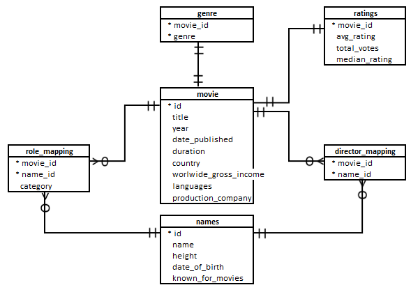

# IMDb Dataset - Finding the best cast
Creating a blockbuster movie requires extensive data analysis. This project uses SQL to identify the best combination of cast members from an IMDb dataset comprising six different tables. The study covers importing data in MySQL with all ER constraints and creating SQLs to find the insights.

# Entity Relation Diagram

# Executive summary of Analysis

## Recommendations

| **Category** | **Matric (if any)** | **Recommendation** | **Fact** |
| --- | --- | --- | --- |
| Genre |     | Drama/ Action/ Comedy | Top three genres with the greatest number of movies with an average rating > 8. |
| Production Company | Number of movies | Dream Warrior Pictures/ National Theatre Live | Highest number of hit movies (average rating > 8). |
| Votes | Marvel Studios/ Twentieth Century Fox/ Warner Bros. | Top three based on the number of votes received by their movies. |
| Hits multilingual | Star Cinema/ Twentieth Century Fox | Top two that have produced the highest number of hits (median rating >= 8) among multilingual. |
| Director |     | Anthony Russo/ James Mangold/ Joe Russo/ Marianne Elliott | Top directors in top three genres whose movies have an average rating > 8. |
| Actor | Overall | Mammootty/ Mohanlal | Top actors whose movies have a median rating >= 8. |
| Indian | Vijay Sethupathi | Best actor (average rating 8.42) in movies released in India. |
| Actress | Drama genre | Parvathy Thiruvothu/ Susan Brown/ Amanda Lawrence/ Denise Gough | Based on number of Super Hit movies (average rating >8). |
| Indian (Hindi) | Taapsee Pannu/ Kriti Sanon | Top actresses (7.74 and 7.05 average rating). |

## Additional Important Insights:

- Year by year the number of movies released in a year is reduced by 2/3 in 3 years (from 3052 to 2001 movies).
- March (824 movies) and September (809 movies) observed most release in 3 years. May-June-July and November-December observe very few released movies.
- Drama movies (4285 movies) are produced the highest in numbers.
- 103.16 is the moving average of average duration for all genres. Also, the most popular genre Drama has an average duration of 106.77 minutes.

# Important Links:
- [SQL used for Analysis](./IMDB%2Bquestion.sql)
- [Executive Summary PDF](./Executive_Summary.pdf)
- [IMDB Dataset Import Script File](./IMDB%2Bdataset%2Bimport.sql)
